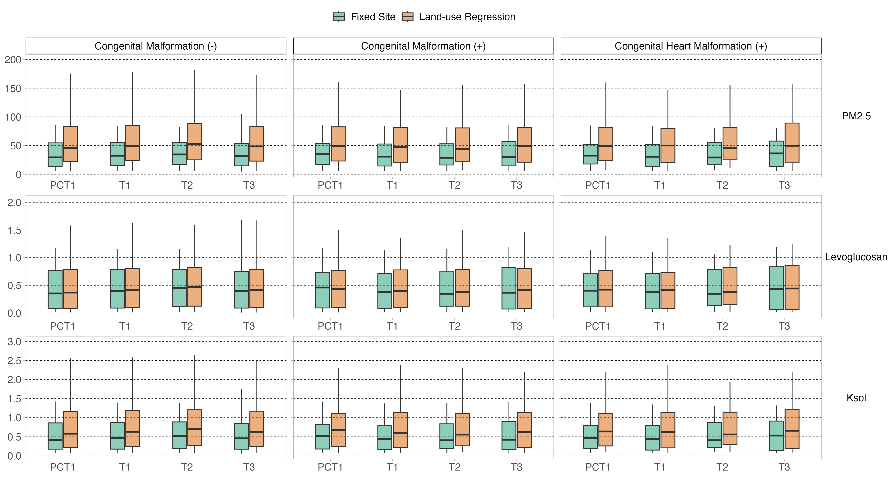
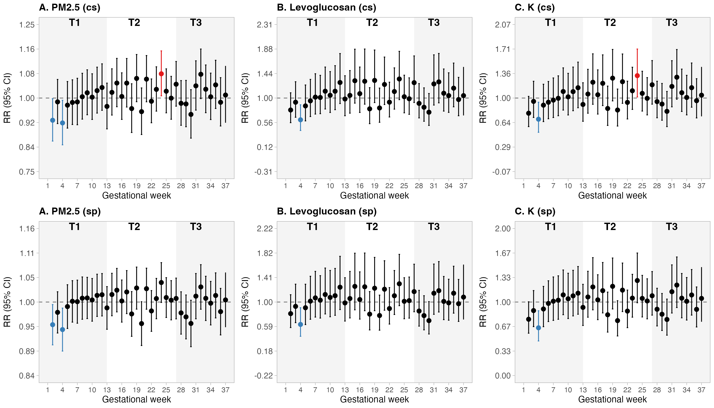
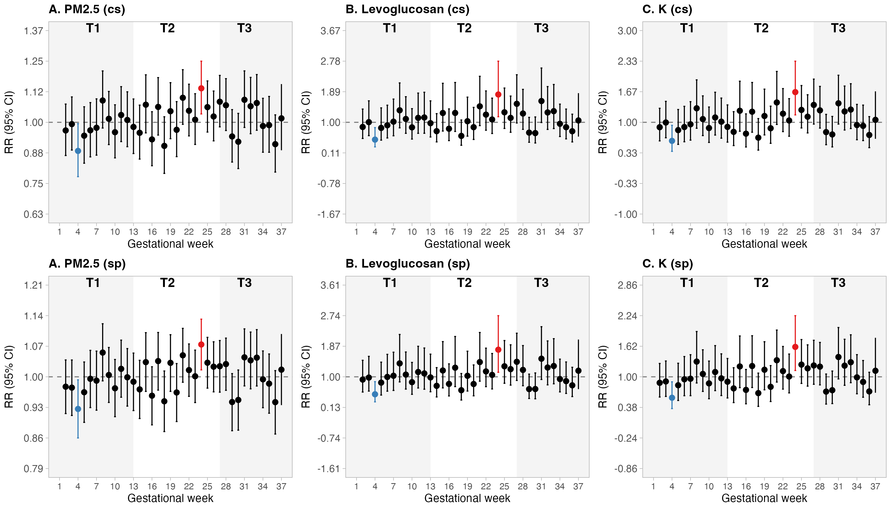
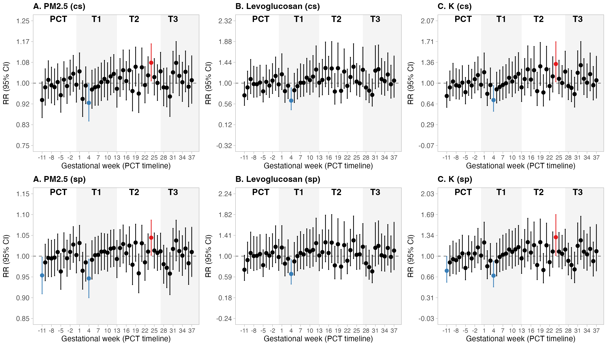
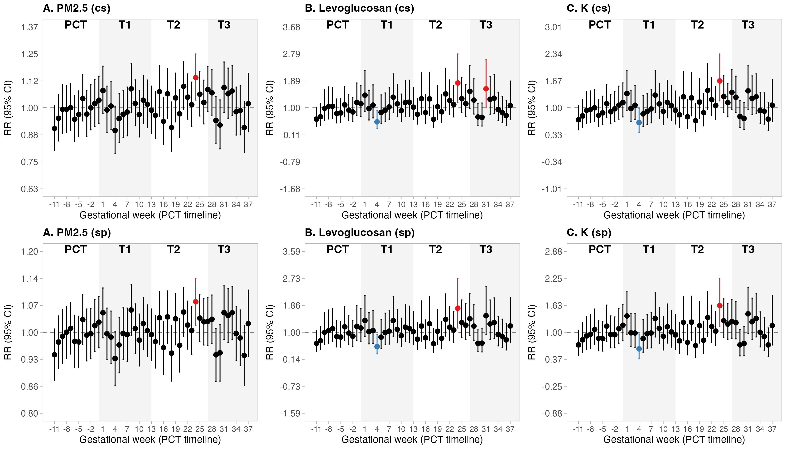

# Exposure to air pollution during pregnancy and congenital malformations in Temuco, Chile, a city heavily impacted by wood-burning

[](LICENSE)

## Funding

**FONDECYT Nº 11240322** — Climate change and urban health: how air pollution, temperature, and city structure relate to preterm birth (and related work on air pollution and newborn health).

## Research team

**Estela Blanco**<sup>1,2</sup> · **Carlos Kilchemmann**<sup>3</sup> · **Ismael Bravo**<sup>1,2</sup> · **José Daniel Conejeros**<sup>1</sup> · **María Elisa Quinteros-Cáceres**<sup>4</sup> · **Salvador Ayala**<sup>5</sup> · **Ximena Ossa**<sup>6</sup> · **Pablo Ruiz-Rudolph**<sup>7</sup>

<sup>1</sup> College UC and Escuela de Salud Pública, Pontificia Universidad Católica de Chile, Santiago, Chile.  
<sup>2</sup> Center for Climate and Resilience Research (CR2), Chile.  
<sup>3</sup> Doctorado en Salud Ambiental y Biomedicina and Escuela de Obstetricia y Puericultura, Universidad Mayor, Chile.  
<sup>4</sup> Departamento de Salud Pública, Facultad de Ciencias de la Salud, Universidad de Talca, Talca, Chile.  
<sup>5</sup> Centro de Epidemiología y Políticas de Salud, Facultad de Medicina Clínica Alemana, Universidad del Desarrollo, Santiago, Chile.  
<sup>6</sup> Departamento de Salud Pública and Centro de Excelencia CIGES, Universidad de la Frontera, Temuco, Chile.  
<sup>7</sup> Programa de Epidemiología, Instituto de Salud Poblacional, Facultad de Medicina, Universidad de Chile, Santiago, Chile.

**Corresponding author:** *To be updated.*

## Publication

*To be updated.*

---

## Project overview

### Background

Exposure to air pollutants has been associated with multiple adverse health effects, including congenital malformations—a leading cause of infant mortality in the first year of life. Clarifying the role of modifiable risk factors such as air pollution is crucial for guiding policy. This need is particularly urgent in southern Chile, where air pollution reaches critical values in winter due to intensive residential wood burning.

### Objective

To evaluate the association between exposure to fine particulate matter (PM<sub>2.5</sub>) and markers of directly emitted wood-burning PM<sub>2.5</sub>—levoglucosan (levo) and water-soluble potassium (K<sub>sol</sub>)—during pregnancy and congenital malformations in the urban area of Temuco and Padre Las Casas between 2009 and 2016.

### Methods

A retrospective cohort design was implemented using secondary data from two previously conducted studies. The study population included all newborns from the Temuco Regional Hospital whose mothers reported residing in the urban area of Temuco and Padre Las Casas during the period of interest. Information on residence, gestational age, date of birth, sex of the newborn, maternal age, and congenital malformations (number and type) was obtained from anonymized hospital records.

Exposure to air pollution was assigned in each week of pregnancy using a temporal exposure model and a land-use regression (LUR) model. Log-binomial regression estimated relative risks (RR) for increases in PM<sub>2.5</sub>, levo, and K<sub>sol</sub> for any congenital malformation and specifically for congenital heart disease, adjusted for season of conception, year of birth, sex of the newborn, and maternal age. Windows of susceptibility were explored with distributed lag models: per gestational week and the 12 weeks pre-conception.

### Key findings

Of 15,452 births in the urban area of Temuco and Padre Las Casas, 267 (1.7%) newborns had a congenital malformation; 128 of these were cardiac malformations. The entire sample was exposed to high levels of air pollution.

There was some evidence of differential risk of any congenital malformation related to wood-burning air pollution in the **second trimester**, and consistent results for increased risk of **congenital heart disease** associated with PM<sub>2.5</sub>, levo, and K<sub>sol</sub> in the **second and third trimesters**. For PM<sub>2.5</sub>, each µg/m³ increase in the third trimester corresponded to an RR of 1.35 (95% CI 1.07–1.69). Exposure in **week 24** showed a consistently increased risk of congenital malformation, particularly congenital heart disease. For week 24, RRs for congenital heart disease were 1.69 (1.14–2.46) for PM<sub>2.5</sub>, 1.81 (1.16–2.78) for levo, and 1.65 (1.16–2.33) for K<sub>sol</sub>.

### Conclusions

Findings suggest that reducing air pollution exposure during later gestation may be important for preventing congenital malformations.

### Illustrative outputs (repository)

**Exposure — descriptive**



*Exposure distributions (descriptive analysis; see scripts in `Code/4.x`).*

**Distributed lag models (trimester panels)**





*Panels from DLM analyses (IQR scaling); see `Output/DLM/` and `Code/6.x`.*

**Distributed lag models (percentile / PCT outputs)**





---

## R code structure

### Setup and utilities (`Code/0.x`)

- `0.1 Settings.R` — Global settings and options  
- `0.2 Packages.R` — Package installation and loading  
- `0.3 Funciones.R` — Custom functions  

### LUR and exposure prediction (`Code/1.0`–`3.1`)

- `1.0 Preparation_LUR_Data.R` — Prepares data for LUR  
- `2.0 Check_LUR .R` — LUR checks *(note: filename contains a space)*  
- `3.0 Predict_LUR_malf_sample_models.R` — Predictions for malformation (sample)  
- `3.1 Predict_LUR_full_sample_models.R` — Predictions for full sample  

### Malformation data and descriptives (`Code/4.x`)

- `4.0 Join_Full_Malf_Data.R` — Joins full malformation and exposure data  
- `4.1 Descriptive_figure_exposure.R` — Descriptive figures for exposure  
- `4.2 Full_data_compilation.R` — Compiles analysis datasets  
- `4.3 Descriptive_tables.R` — Descriptive tables  

### Exposure–outcome models (`Code/5.x`)

- `5.0 Exposure_Models_Malf.R` — Core exposure models (malformations)  
- `5.1 Exposure_Models_Malf_IQR.R` — Models with IQR-scaled exposure  
- `5.3 Exposure_Models_Malf_IQR_by_sex.R` — IQR models stratified by sex  
- `5.4 Exposure_Models_Malf_10.R` — Models with /10 exposure scaling  
- `5.5 Table_models_10.R` — Tables for div10 models  
- `5.6 Exposure_Models_Malf_10_by_sex.R` — Div10 models by sex  

### Distributed lag models (`Code/6.x`)

- `6.0 DLM_malf_prototype.R` — DLM prototype  
- `6.1 DLM_malf_full_models_IQR.R` — Full-sample DLM (IQR)  
- `6.2 DLM_malf_pct_full_models_IQR.R` — DLM with percentile (PCT) specifications  
- `6.3 DLM_malf_summary_excel.R` — Exports DLM summaries to Excel  

---

## Principal outputs

### Exposure models

Intermediate and final model objects and tables are saved under `Output/Models/` (e.g. `Exposure_models_malf*.RData`, `List_models_exposure_malf*.xlsx`) and summarised tables under `Output/Tables/` (e.g. `Table_IQR_adjusted_malf*.xlsx`, `Table_div10_adjusted_malf*.xlsx`).

### Distributed lag models

- `Output/DLM/Malf_DLM_results_all_models_IQR.xlsx` — DLM results (IQR), all models  
- `Output/DLM/Malf_DLM_summary_DLM.xlsx` — Summary workbook  
- `Output/DLM/PCT/Malf_DLM_results_PCT_models_IQR.xlsx` — PCT / percentile DLM results  

Descriptive spreadsheets: `Output/Descriptive_exposure_tables_malf.xlsx`, `Output/Descriptive_table_malformation.xlsx`.

---

## Data availability

### Analysis datasets (generated in this pipeline)

Key processed objects are written to `Output/` (e.g. `Data_full_sample_exposure.RData`, `Data_malf_exposure_long.RData`, `Data_malf_exposure_wide.RData`, `base_final.RData`). **Individual-level input data are not committed** to the repository (see `.gitignore`).

### Data access

**Restricted access.** Requests for data supporting this study may be submitted to the study team. Due to privacy regulations, individual-level hospital records cannot be shared publicly; aggregated results and analysis code are provided here where possible.

---

## Reproducibility

### System requirements

- R ≥ 4.0.0  
- Packages installed via `Code/0.2 Packages.R`, including (non-exhaustive): `rio`, `data.table`, `tidyverse`, `future`, `furrr`, `ragg`, `writexl`, `survival`, `tictoc`, `sp`, `classInt`, `RColorBrewer`, `spatialEco`, `splines`, `future.apply`, `ggpubr`  

### Suggested run order

1. **Setup**

   ```r
   source("Code/0.1 Settings.R")
   source("Code/0.2 Packages.R")
   source("Code/0.3 Funciones.R")
   ```

2. Continue with numbered scripts in order (`1.0` → `6.3`) according to which outputs you need; later scripts assume intermediates exist in `Output/` and/or `Input/`/`Ref/` as defined in each script.

Runtime depends on hardware and parallel settings; DLM scripts (`6.x`) are typically the most computationally intensive.

---

## Repository structure

```
Pollution_Malformation_TEM/
├── Code/
│   ├── 0.1 Settings.R
│   ├── 0.2 Packages.R
│   ├── 0.3 Funciones.R
│   ├── 1.0 Preparation_LUR_Data.R
│   ├── 2.0 Check_LUR .R
│   ├── 3.0 Predict_LUR_malf_sample_models.R
│   ├── 3.1 Predict_LUR_full_sample_models.R
│   ├── 4.0 Join_Full_Malf_Data.R
│   ├── 4.1 Descriptive_figure_exposure.R
│   ├── 4.2 Full_data_compilation.R
│   ├── 4.3 Descriptive_tables.R
│   ├── 5.0 Exposure_Models_Malf.R
│   ├── 5.1 Exposure_Models_Malf_IQR.R
│   ├── 5.3 Exposure_Models_Malf_IQR_by_sex.R
│   ├── 5.4 Exposure_Models_Malf_10.R
│   ├── 5.5 Table_models_10.R
│   ├── 5.6 Exposure_Models_Malf_10_by_sex.R
│   ├── 6.0 DLM_malf_prototype.R
│   ├── 6.1 DLM_malf_full_models_IQR.R
│   ├── 6.2 DLM_malf_pct_full_models_IQR.R
│   └── 6.3 DLM_malf_summary_excel.R
├── Output/                     # Generated tables, figures, .RData (see .gitignore)
├── Input/                     # Not tracked (see .gitignore)
├── Ref/                       # Not tracked (see .gitignore)
├── LICENSE
└── README.md
```

---

## Important notes

### Data privacy

Individual-level clinical records are confidential. Public sharing follows institutional and national regulations; use aggregated outputs in this repository where available.

### Geographic context

Temuco–Padre Las Casas experiences severe winter air pollution largely driven by residential wood burning. Levoglucosan and water-soluble potassium complement PM<sub>2.5</sub> as tracers of biomass-related particles.

---

## Contact

For questions about **code or methods**, contact the research team (corresponding author to be listed under **Research team**).

For **data access**, contact the corresponding author once designated.

---

## License

This project is licensed under the terms in the [LICENSE](LICENSE) file (MIT).

---

## Acknowledgments

E.B. acknowledges **FONDECYT Nº 11240322** and the **Center for Climate and Resilience Research (CR2)**, funded by the Chilean Ministry of Education through the Actividades de Interés Nacional (AIN) program, hosted at the University of Chile.

---

## Conflicts of interest

The authors declare no conflicts of interest.

---

## CRediT authorship contribution statement

Guidance: [Elsevier CRediT author statement](https://www.elsevier.com/researcher/author/policies-and-guidelines/credit-author-statement).

| Author | Contribution |
|--------|---------------|
| Estela Blanco | Conceptualization, methodology, software, validation, resources, supervision, writing — original draft preparation |
| Carlos Kilchemmann | Conceptualization, methodology, writing — review, writing — original draft preparation |
| Ismael Bravo | Methodology, software, validation, formal analysis, data curation, writing — review & editing, visualization |
| José Daniel Conejeros | Methodology, software, validation, formal analysis, data curation, writing & editing, visualization |
| María Elisa Quinteros-Cáceres | Writing — review & editing |
| Salvador Ayala | Writing — review & editing |
| Ximena Ossa | Writing — review & editing |
| Pablo Ruiz-Rudolph | Methodology, software, resources, writing — review & editing |
